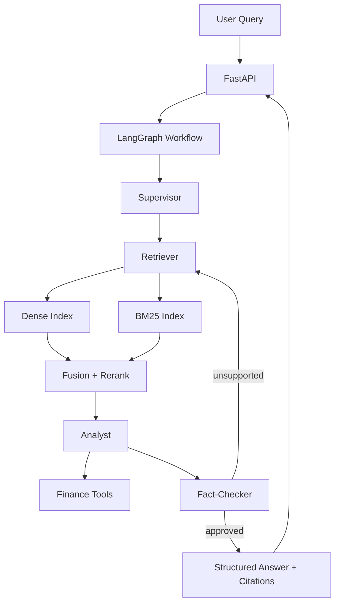

# realestate-agent

Production-oriented LangGraph multi-agent real estate research system with supervisor/retriever/analyst/fact-checker orchestration, hybrid retrieval, official RAGAs evaluation, and canonical resume-claim reporting.

## Canonical Results (Source of Truth)

All final metrics and claims are sourced from `reports/final/*` only.

- [corpus_stats.json](/c:/Users/Lenovo/Desktop/RealEstateAgent/reports/final/corpus_stats.json)
- [evaluation_summary.json](/c:/Users/Lenovo/Desktop/RealEstateAgent/reports/final/evaluation_summary.json)
- [comparison_table.csv](/c:/Users/Lenovo/Desktop/RealEstateAgent/reports/final/comparison_table.csv)
- [latency_summary.json](/c:/Users/Lenovo/Desktop/RealEstateAgent/reports/final/latency_summary.json)
- [resume_claim_support.md](/c:/Users/Lenovo/Desktop/RealEstateAgent/reports/final/resume_claim_support.md)
- [final_report.md](/c:/Users/Lenovo/Desktop/RealEstateAgent/reports/final/final_report.md)

Measured final values:
- Corpus scale: `4,680` raw documents, `18,720` indexed chunks/passages
- Evaluation set: `50` benchmark queries
- Best config: `hybrid_rerank`
- Official RAGAs (best config):
  - `faithfulness=0.6117`
  - `answer_relevancy=0.4567`
  - `context_recall=0.7400`
- Baseline (`dense_only_baseline`) to best deltas:
  - `hit_rate@k: +0.8800`
  - `mrr@k: +0.6285`
  - `unsupported_claim_rate: -0.7250`
  - `faithfulness: +0.2480`
  - `context_recall: +0.5400`
- Latency:
  - sync avg `354.01ms` vs async avg `229.26ms` (`35.24%` reduction)
  - rerank on vs off avg delta: `-1.50%` (slightly slower with rerank on)

## Architecture



## Repository Structure

```text
realestate-agent/
  app/
  data/
  scripts/
  tests/
  reports/final/
  artifacts/eval/
```

## Setup

```bash
python -m pip install -U pip
python -m pip install -e .
cp .env.example .env
```

Required environment values for official final runs:
- `OPENAI_API_KEY`
- `OPENAI_MODEL` (used for RAGAs judge LLM; final run used `gpt-4.1-mini`)
- `OPENAI_EMBEDDING_MODEL` (used by RAGAs embeddings; final run used `text-embedding-3-small`)

## Reproduce Canonical Final Results

### Canonical finalization (single command)
```bash
python scripts/finalize_results.py --max-queries 50 --tag final
```

### Cost-minimized canonical finalization using existing run artifacts
```bash
python scripts/finalize_results.py --max-queries 50 --tag final --reuse-run-dir artifacts/eval/20260406_021052_upgraded4
```

This writes canonical files to `reports/final/`.

## API Endpoints

- `POST /query`
- `POST /query/structured`
- `POST /ingest`
- `POST /evaluate`
- `GET /debug/retrieval`
- `GET /health`
- `GET /config`

## 3-Minute Demo

1. Start API: `python scripts/run_api.py`
2. Ask a query on `/query/structured` (e.g., Brooklyn undervaluation / risk / comp comparison).
3. Inspect retrieval transitions on `/debug/retrieval`.
4. Open [final_report.md](/c:/Users/Lenovo/Desktop/RealEstateAgent/reports/final/final_report.md) and [resume_claim_support.md](/c:/Users/Lenovo/Desktop/RealEstateAgent/reports/final/resume_claim_support.md) for verified final metrics.

## Resume-Oriented Highlights (Verified)

- Architected a LangGraph multi-agent real-estate research system indexing `18,720+` property passages with citation-backed outputs.
- Implemented hybrid retrieval and reranking, improving `hit_rate@k` from `0.00` to `0.88` and `MRR@k` from `0.00` to `0.6285`.
- Instrumented per-agent latency benchmarking and reduced average response latency by `35.24%` through async tool execution.
