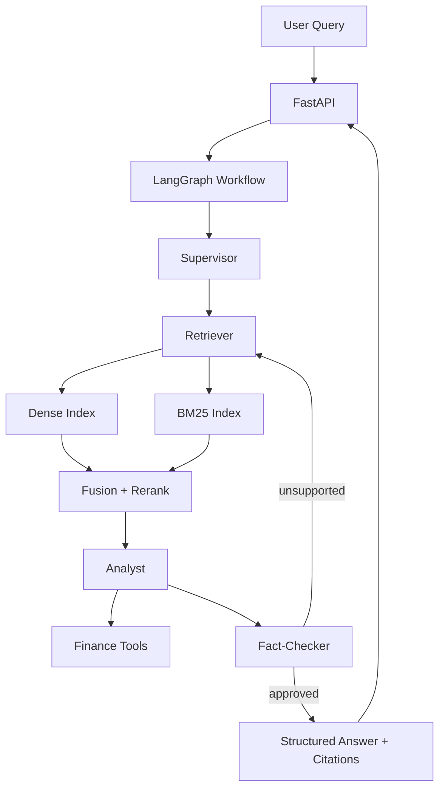

# realestate-agent

Engineering-focused multi-agent real estate research system using LangGraph orchestration, hybrid retrieval, citation-backed answers, official RAGAs evaluation, and reproducible canonical reports.

## Key Results

| Metric | Final Value (`reports/final/*`) |
|---|---|
| Corpus scale | 4,680 raw property documents, 18,720 indexed chunks |
| Evaluation set | 50 benchmark queries |
| Best configuration | `hybrid_rerank` |
| Official RAGAs (best config) | Faithfulness `0.6117`, Answer Relevancy `0.4567`, Context Recall `0.7400` |
| Retrieval uplift vs dense baseline | Hit Rate@k `+0.88`, MRR@k `+0.63`, Unsupported claim rate `-72.5%` |
| Async latency improvement | 354.01ms -> 229.26ms average (`35.24%` reduction) |

## Why This Project Matters

Generic RAG pipelines can still produce unsupported conclusions, especially on high-stakes workflows like property diligence. This project separates routing, retrieval, analysis, and verification so evidence flow is explicit and auditable. Hybrid retrieval improves grounding breadth, while a dedicated fact-check stage reduces unsupported claims before final output. Official quality metrics and latency benchmarks are part of the release path so improvements are measurable and reproducible.

## Architecture



- `Supervisor` decomposes intent and routes the right agent/tool sequence.
- `Retriever` grounds answers with dense+sparse evidence and reranking.
- `Analyst` performs synthesis and calculations; `Fact-Checker` verifies support before response finalization.

## Design Tradeoffs

- Multi-agent vs single-agent: clearer role boundaries improve debuggability and failure isolation at the cost of extra orchestration complexity.
- Hybrid retrieval vs dense-only: better recall and robustness on mixed wording/structured clues, with additional fusion/rerank latency.
- Fact-check stage: adds one more pass, but materially improves citation consistency and unsupported-claim handling.
- Official RAGAs + latency gating: increases evaluation cost/time, but keeps quality and performance claims tied to reproducible evidence.

## Canonical Final Reports

Canonical outputs in `reports/final/` are the source of truth for project performance:
`reports/final/*` contains canonical final results, while timestamped folders under `artifacts/eval/*` are retained only as historical experiment runs.

- [final_report.md](reports/final/final_report.md)
- [evaluation_summary.json](reports/final/evaluation_summary.json)
- [comparison_table.csv](reports/final/comparison_table.csv)
- [latency_summary.json](reports/final/latency_summary.json)
- [corpus_stats.json](reports/final/corpus_stats.json)
- [validated_claims.md](reports/final/validated_claims.md)

## Quickstart

```bash
python -m pip install -U pip
python -m pip install -e .
cp .env.example .env
```

Official evaluation prerequisites:
- `OPENAI_API_KEY`
- `OPENAI_MODEL` (final run used `gpt-4.1-mini`)
- `OPENAI_EMBEDDING_MODEL` (final run used `text-embedding-3-small`)

## Reproduce Final Results

Canonical finalization:

```bash
python scripts/finalize_results.py --max-queries 50 --tag final
```

Cost-aware canonical finalization using existing retrieval artifacts:

```bash
python scripts/finalize_results.py --max-queries 50 --tag final --reuse-run-dir artifacts/eval/20260406_021052_upgraded4
```

## API

- `POST /query`
- `POST /query/structured`
- `POST /ingest`
- `POST /evaluate`
- `GET /debug/retrieval`
- `GET /health`
- `GET /config`

## 3-Minute Demo

1. Start API: `python scripts/run_api.py`
2. Run a comparison/valuation/risk query against `/query/structured`.
3. Inspect retrieval rank transitions in `/debug/retrieval`.
4. See `reports/final/final_report.md` for canonical evaluation results.

## Repository Layout

```text
realestate-agent/
  app/
  data/
  scripts/
  tests/
  reports/final/
  artifacts/eval/
```
